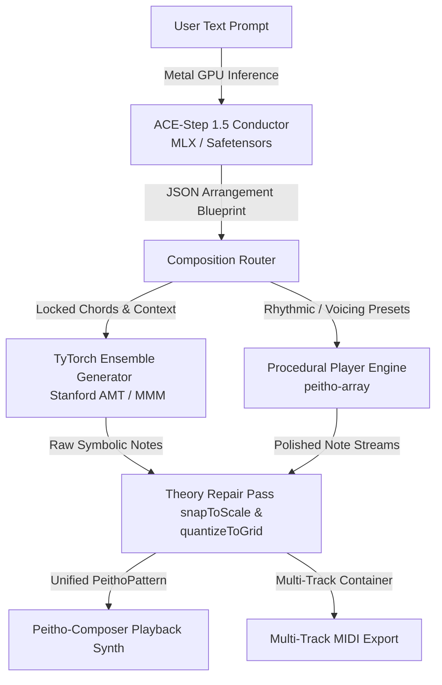

# Specification: AI-Assisted Session Players for Peitho

## 1. Executive Summary & Vision

This document details the technical specification and architectural plan to build interactive **Session Players** inside the Peitho ecosystem. Inspired by the interactive studio musicians in Logic Pro but expanded for deeper musical customisation, these players run **strictly locally** on macOS with **zero Python dependencies**.

The system utilises a **hybrid engine design** that combines deterministic music-theory heuristics with local symbolic Artificial Intelligence. High-level performance guidelines are interpreted by a language model, note generation is executed by a multi-track transformer running natively via **TyTorch**, and final performances are polished, snapped, and quantised by the procedural core.



---

## 2. The Hybrid Player Architecture

To maintain sub-10ms latency during playback and live macro adjustments, Peitho-Composer splits player logic between two layers:

### 2.1 The Procedural Layer (`peitho-array`)
Responsible for instant, zero-latency rendering of structured playing styles. It uses mathematical music theory matrices to voice chords, calculate arpeggios, and gate rhythmic patterns.
*   **Use Cases**: Guitar strumming patterns, string pads voice leading, steady keyboard comping, and standard drum loops.
*   **Overhead**: Sub-millisecond CPU execution; zero VRAM footprint.

### 2.2 The Symbolic AI Layer (`peitho-pulse`)
Responsible for creative, non-deterministic phrasing, human-like fills, and complex contrapuntal motion.
*   **Use Cases**: Expressive synthesiser leads, syncopated drum breaks, and call-and-response companion lines.
*   **Overhead**: Low VRAM usage (<200MB); sub-100ms inference on Apple Silicon GPUs.

---

## 3. Session Player Personas & Instruments

Each instrument track is represented by an active virtual player with selectable performance presets and style modifiers:

### 3.1 The Guitar Player
*   **Role**: Harmonic rhythm and texture.
*   **Method**: Procedural chord voicing combined with rhythmic gating.
*   **Style Presets**:
    *   *Acoustic Strummer*: Translates keyboard chords into realistic open-string guitar fingerings (with proper fretboard transitions) and applies alternating downstroke/upstroke strumming patterns.
    *   *Travis Picker*: Arpeggiates chords using fingerpicking patterns (such as alternating bass notes and syncopated treble rings).
    *   *Muted Drive*: Rhythmic, palm-muted power chord pulses locked to sixteenth-note grids.

### 3.2 The Keyboard/Piano Player
*   **Role**: Harmonic foundation and rhythmic comping.
*   **Method**: Hybrid (Procedural arpeggiation + Transformer generation).
*   **Style Presets**:
    *   *Jazz Comping*: Off-beat, syncopated chord stabs that *listen* to the drum beat to fill in rhythmic gaps.
    *   *Arpeggiator*: Cascading patterns up, down, or alternating through active chord tones.
    *   *Classic Stride*: Alternating low bass octaves on downbeats and mid-register chords on upbeats.

### 3.3 The String Player
*   **Role**: Sustained atmospheric glue.
*   **Method**: Algorithmic voice leading.
*   **Logic**:
    *   Voiced across an orchestral ensemble (violins, violas, cellos).
    *   Enforces strict **minimal-motion voice leading**: when chords change, individual notes move to the nearest scale degree. Common notes between adjacent chords are held continuously to prevent disjointed jumps.

### 3.4 The Bass Player
*   **Role**: Rhythmic and tonal anchor.
*   **Method**: Procedural heuristics.
*   **Style Presets**:
    *   *Walking Bass*: Step-wise melodic motion connecting chord roots using scale intervals and chromatic passing tones.
    *   *Pop Root-Fifth*: Alternating root and fifth patterns locked to primary downbeats.
    *   *Synth Drive*: Steady eighth-note or sixteenth-note pulses with dynamic velocity accents.

### 3.5 The Synth/Lead Player
*   **Role**: Rhythmic hooks and monophonic melodies.
*   **Method**: Autoregressive transformer generation (TyTorch / AMT).
*   **Style Presets**:
    *   *Ambient Riff*: Sparsely distributed melodic motifs using long delay times.
    *   *Techno Arp*: Fast, syncopated patterns running in sync with the master clock.

### 3.6 The Drum Player
*   **Role**: The rhythmic engine.
*   **Method**: Symbolic AI (DrumsRNN / AMT) or procedural patterns.
*   **Style Presets**:
    *   *Steady Pocket*: Reliable, on-the-grid grooves.
    *   *Syncopated Funk*: Off-beat hi-hats, ghost snare rolls, and complex kick placements.

---

## 4. The Pre-Trained Model Selection

To avoid the massive time and computational expense of custom training, we utilise established, high-quality pre-trained models trained on massive MIDI corpora:

### 4.1 The Conductor: ACE-Step 1.5 (MLX)
*   **Model**: Quantised 3B or 1.5B Parameter Language Model.
*   **Task**: Translates natural language prompts into structural blueprints.
*   **Execution**: Loaded directly into Apple Silicon VRAM (via 4-bit quantization). It outputs a JSON payload containing tempo, key, scale, chords, and style selections for each player track.

### 4.2 The Ensemble: Anticipatory Music Transformer (TyTorch)
*   **Model Checkpoint**: `stanford-crfm/music-medium-800k` (Stanford Center for Research on Foundation Models).
*   **Task**: Multi-track, chord-conditioned note generation.
*   **Training Corpus**: Lakh MIDI Dataset (LMD) — comprising over 170,000 multi-track performances.
*   **Execution**: Generates note sequences for bass, guitar, piano, and synth in parallel, maintaining temporal awareness across all tracks.

---

## 5. The Python-Free Local Runtime Stack

The entire application runs inside Bun/TypeScript. **No Python runtime is involved at any stage.**

### 5.1 TyTorch Node-API Integration
We use **TyTorch** (`astrohackerlabs/tytorch`) to load and run our MIDI transformers:
1.  **Direct Checkpoint Loading**: TyTorch parses standard PyTorch binary weight checkpoints (`pytorch_model.bin` or `model.safetensors`) natively within TypeScript using array buffers.
2.  **C++ Hardware Acceleration**: TyTorch bridges directly to the pre-compiled C++ **libtorch** library (`libtorch.dylib`) on macOS. Tensor computations are executed on the Mac GPU via Metal, completely bypassing Python's GIL and interpreter overhead.

```
+-------------------------------------------------------------+
|               Peitho-Composer (TypeScript UI)               |
+-------------------------------------------------------------+
                               |
                       (Direct Import)
                               v
+-------------------------------------------------------------+
|             @peitho/pulse (TypeScript Wrapper)              |
+-------------------------------------------------------------+
                               |
                        (TyTorch API)
                               v
+-------------------------------------------------------------+
|             libtorch.dylib (C++ PyTorch Engine)             |
|   - Runs tensor matrix operations on Apple Metal GPU.       |
+-------------------------------------------------------------+
```

### 5.2 MLX for Conductor Prompts
For the ACE-Step 1.5 Conductor model, Bun links to the Apple Silicon Metal framework using `node-mlx` or `bun:ffi` to access `libmlx.dylib`. This enables zero-copy memory allocation, allowing the GPU to read the quantised LLM weights instantly from the system's unified memory.

---

## 6. Co-Creative Human-AI Workflows (In-Filling)

Session players support dynamic continuation and collaborative writing. If a composer hand-edits a track (e.g., writes the first 2 bars of a guitar riff):
1.  The frontend flags the existing notes as an active **override sequence**.
2.  The TyTorch engine reads this override data and passes it as a **primer sequence** to the model.
3.  The model runs its causal continuation step starting exactly at the end of the user's edit (e.g. step 32) and generates the remaining bars.
4.  The generated performance is merged back with the user's hand-drawn notes, ensuring a seamless continuation of the composer's original motif.
